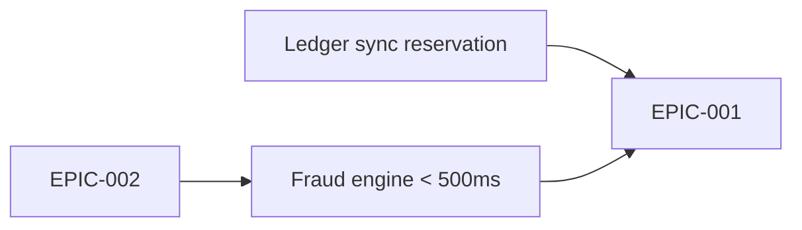

# PI Planning — Q3 2026

| Field | Value |
|-------|-------|
| **Date** | 2026-06-26 |
| **Facilitator** | D. Novak (Scrum Master) |
| **Participants** | Helios team, PO, BA, Risk & Compliance, Platform team |
| **Program increment** | Q3 (Sprints 42–47) |

## PI objectives

| # | Objective | Confidence |
|---|-----------|-----------|
| 1 | Instant Payments API to GA | High |
| 2 | Real-time fraud screening live | Medium |
| 3 | Partner sandbox environment | Medium |

## Committed epics

- [EPIC-001 · Instant Payments](../epics/epic-001-instant-payments.md) — target v2.4.0.
- [EPIC-002 · Fraud & Risk Screening](../epics/epic-002-fraud-risk-screening.md) — target v2.5.0.

## Key decisions

| # | Decision | Rationale |
|---|----------|-----------|
| D1 | Fraud scoring is called **synchronously** within the payment flow | Instant settlement is irreversible; screening must be pre-settlement |
| D2 | 500 ms scoring budget with a **rules-only fallback** | Protects the 10-second settlement SLA if the ML model is slow |
| D3 | Deprecate `/v1/transfers` | Consolidate on the v2 payments API |

## Risks & dependencies

## Action items

| Action | Owner | Due |
|--------|-------|-----|
| Confirm ledger sync API contract | Platform team | Sprint 42 |
| Draft partner sandbox proposal | A. Rivera | Sprint 43 |
