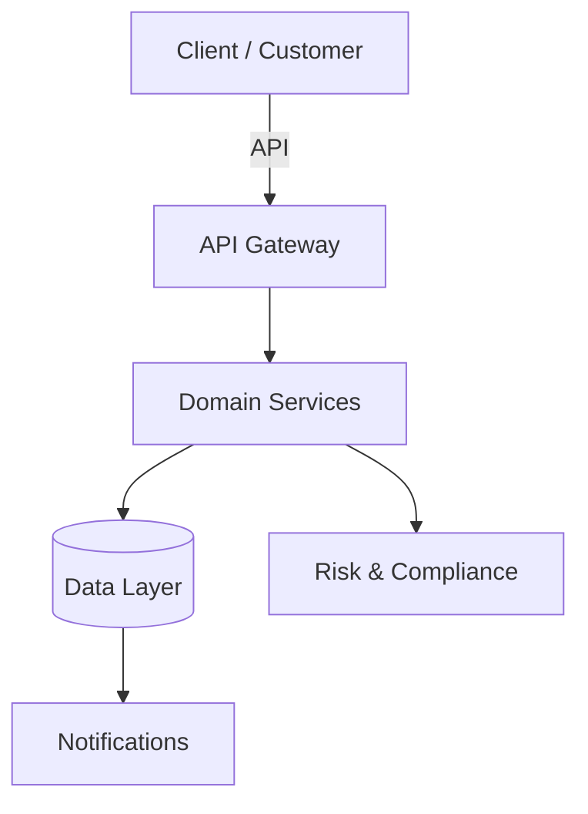

# Welcome to Documentation

Your single source of truth for planning, requirements, technical, and delivery documentation.

- :material-account-group: **[Agile](agile/index.md)** — Epics, stories, BRDs, and sprint reports
- :material-code-braces: **[Technical](technical/index.md)** — APIs, architecture, ADRs, and runbooks
- :material-book-open: **[User Guides](user-guides/index.md)** — Getting started, features, and FAQ
- :material-content-copy: **[Templates](doc-templates/index.md)** — Start any document from a consistent baseline

## Quick Links

- :material-rocket-launch: **[Getting Started](user-guides/getting-started/index.md)** — New here? Start here
- :material-file-document: **[Latest Release](agile/release-notes/v2.4.0.md)** — What's new
- :material-chart-line: **[Sprint Report](agile/reports/sprint-42-review.md)** — Current sprint status

## Documentation Principles

1. **Single source of truth** — If it's a plan, requirement, or decision, it lives here
2. **Traceable** — Business need → BRD → Epic → Story → Release
3. **Reviewed** — Changes go through pull requests
4. **Versioned** — Every edit is kept forever

## Our Platform

