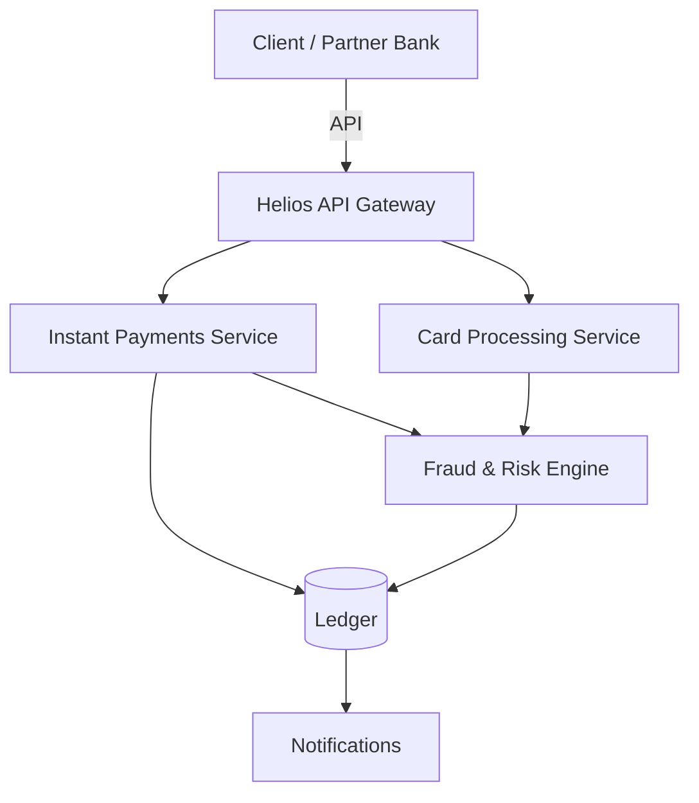

# Agile Docs Enterprise Adaptation Implementation Plan

> **For agentic workers:** REQUIRED SUB-SKILL: Use superpowers:subagent-driven-development (recommended) or superpowers:executing-plans to implement this plan task-by-task. Steps use checkbox (`- [ ]`) syntax for tracking.

**Goal:** Adapt the agile-docs-demo repository into an enterprise-scale documentation system with mixed content (agile, technical, user guides) on GitHub Pages.

**Architecture:** Monorepo with MkDocs Material theme, modular navigation, enhanced plugins for scale, GitHub automation for non-technical users, and corporate visual customization.

**Tech Stack:** MkDocs Material, Python, GitHub Actions, GitHub Issues/Projects

---

## Phase 1: Base Structure (High Priority)

### Task 1: Create Directory Structure

**Files:**
- Create: `docs/agile/index.md`
- Create: `docs/technical/index.md`
- Create: `docs/user-guides/index.md`
- Create: `docs/stylesheets/`
- Create: `docs/assets/`

- [ ] **Step 1: Create agile directory structure**

```bash
mkdir -p docs/agile/{epics,stories,brds,release-notes,reports,meeting-notes}
```

- [ ] **Step 2: Create technical directory structure**

```bash
mkdir -p docs/technical/{api,architecture,adrs,runbooks}
```

- [ ] **Step 3: Create user-guides directory structure**

```bash
mkdir -p docs/user-guides/{getting-started,features,faq}
```

- [ ] **Step 4: Create stylesheets and assets directories**

```bash
mkdir -p docs/stylesheets docs/assets
```

- [ ] **Step 5: Create index.md files for each domain**

Create `docs/agile/index.md`:
```markdown
# Agile Documentation

Epics, user stories, BRDs, release notes, and sprint reports.

<div class="grid cards" markdown>

- :material-clipboard-text: **[Epics](epics/index.md)** — Large bodies of work
- :material-file-document: **[User Stories](stories/index.md)** — Deliverable slices of value
- :material-file-check: **[BRDs](brds/index.md)** — Business requirements
- :material-tag: **[Release Notes](release-notes/index.md)** — What shipped

</div>
```

Create `docs/technical/index.md`:
```markdown
# Technical Documentation

API references, architecture decisions, runbooks, and system design.

<div class="grid cards" markdown>

- :material-code-braces: **[API](api/index.md)** — API references
- :material-sitemap: **[Architecture](architecture/index.md)** — System design
- :material-file-tree: **[ADRs](adrs/index.md)** — Architecture decisions
- :material-book-open: **[Runbooks](runbooks/index.md)** — Operational guides

</div>
```

Create `docs/user-guides/index.md`:
```markdown
# User Guides

Getting started, feature documentation, and FAQ.

<div class="grid cards" markdown>

- :material-rocket-launch: **[Getting Started](getting-started/index.md)** — First steps
- :material-star: **[Features](features/index.md)** — Feature guides
- :material-frequently-asked-questions: **[FAQ](faq/index.md)** — Common questions

</div>
```

- [ ] **Step 6: Commit directory structure**

```bash
git add docs/agile/ docs/technical/ docs/user-guides/ docs/stylesheets/ docs/assets/
git commit -m "feat: create enterprise directory structure"
```

---

### Task 2: Move Existing Content

**Files:**
- Move: `docs/epics/` → `docs/agile/epics/`
- Move: `docs/stories/` → `docs/agile/stories/`
- Move: `docs/brds/` → `docs/agile/brds/`
- Move: `docs/release-notes/` → `docs/agile/release-notes/`
- Move: `docs/reports/` → `docs/agile/reports/`
- Move: `docs/meeting-notes/` → `docs/agile/meeting-notes/`
- Move: `docs/doc-templates/` → `docs/templates/`

- [ ] **Step 1: Move agile content to agile subdirectory**

```bash
git mv docs/epics docs/agile/
git mv docs/stories docs/agile/
git mv docs/brds docs/agile/
git mv docs/release-notes docs/agile/
git mv docs/reports docs/agile/
git mv docs/meeting-notes docs/agile/
```

- [ ] **Step 2: Move templates to root level**

```bash
git mv docs/doc-templates docs/templates
```

- [ ] **Step 3: Update internal links in moved files**

Update relative paths in all moved files. For example, in `docs/agile/stories/hel-142-send-instant-payment.md`:

Change:
```markdown
| **Epic** | [EPIC-001 · Instant Payments](../epics/epic-001-instant-payments.md) |
```

To:
```markdown
| **Epic** | [EPIC-001 · Instant Payments](../epics/epic-001-instant-payments.md) |
```

(Same relative path works since files moved together)

- [ ] **Step 4: Verify links work**

```bash
mkdocs build --strict
```

Expected: Build succeeds (or shows only external link warnings)

- [ ] **Step 5: Commit content moves**

```bash
git add docs/
git commit -m "refactor: move agile content to agile/ subdirectory"
```

---

### Task 3: Update mkdocs.yml Configuration

**Files:**
- Modify: `mkdocs.yml`

- [ ] **Step 1: Update nav structure**

Replace the entire `nav:` section in `mkdocs.yml` with:

```yaml
nav:
  - Home: index.md
  # --- Agile ---
  - Agile:
    - Overview: agile/index.md
    - Epics:
      - agile/epics/index.md
      - "EPIC-001 · Instant Payments": agile/epics/epic-001-instant-payments.md
      - "EPIC-002 · Fraud & Risk Screening": agile/epics/epic-002-fraud-risk-screening.md
    - User Stories:
      - agile/stories/index.md
      - "HEL-142 · Send instant payment": agile/stories/hel-142-send-instant-payment.md
      - "HEL-158 · Real-time fraud score": agile/stories/hel-158-realtime-fraud-score.md
    - Business Requirements:
      - agile/brds/index.md
      - "BRD · Instant Payments": agile/brds/brd-instant-payments.md
    - Release Notes:
      - agile/release-notes/index.md
      - "v2.4.0": agile/release-notes/v2.4.0.md
      - "v2.3.0": agile/release-notes/v2.3.0.md
    - Reports:
      - agile/reports/index.md
      - "Sprint 42 Review": agile/reports/sprint-42-review.md
      - "Sprint 42 Retrospective": agile/reports/sprint-42-retrospective.md
    - Meeting Notes:
      - agile/meeting-notes/index.md
      - "PI Planning — Q3": agile/meeting-notes/pi-planning-q3.md
  # --- Technical ---
  - Technical:
    - Overview: technical/index.md
    - API:
      - technical/api/index.md
    - Architecture:
      - technical/architecture/index.md
    - ADRs:
      - technical/adrs/index.md
    - Runbooks:
      - technical/runbooks/index.md
  # --- User Guides ---
  - User Guides:
    - Overview: user-guides/index.md
    - Getting Started:
      - user-guides/getting-started/index.md
    - Features:
      - user-guides/features/index.md
    - FAQ:
      - user-guides/faq/index.md
  # --- Templates ---
  - Templates:
    - Overview: templates/index.md
    - Epic: templates/epic-template.md
    - User Story: templates/user-story-template.md
    - BRD: templates/brd-template.md
    - Release Note: templates/release-note-template.md
    - ADR: templates/adr-template.md
    - Meeting Notes: templates/meeting-notes-template.md
```

- [ ] **Step 2: Add new plugins**

Update the `plugins:` section in `mkdocs.yml`:

```yaml
plugins:
  - search:
      separator: '[\s\-\.]+'
      lang: es
  - macros:
      module_name: main
  - git-revision-date-localized:
      type: datetime
      locale: es
  - tags:
      tags_file: tags.md
  - redirects:
      redirect_maps:
        'epics/index.md': 'agile/epics/index.md'
        'stories/index.md': 'agile/stories/index.md'
        'brds/index.md': 'agile/brds/index.md'
        'release-notes/index.md': 'agile/release-notes/index.md'
        'reports/index.md': 'agile/reports/index.md'
        'meeting-notes/index.md': 'agile/meeting-notes/index.md'
        'doc-templates/index.md': 'templates/index.md'
```

- [ ] **Step 3: Update requirements.txt**

```bash
cat > requirements.txt << 'EOF'
mkdocs-material==9.5.39
pymdown-extensions==10.11.2
mkdocs-macros==1.3.7
mkdocs-git-revision-date-localized==1.3.0
mkdocs-tags==0.6.0
mkdocs-redirects==1.3.0
EOF
```

- [ ] **Step 4: Verify build works**

```bash
pip install -r requirements.txt
mkdocs build --strict
```

Expected: Build succeeds

- [ ] **Step 5: Commit configuration changes**

```bash
git add mkdocs.yml requirements.txt
git commit -m "feat: update mkdocs.yml with new structure and plugins"
```

---

### Task 4: Create ADR Template

**Files:**
- Create: `docs/templates/adr-template.md`

- [ ] **Step 1: Create ADR template**

```markdown
# ADR-### · <Decision title>

| Field | Value |
|-------|-------|
| **Status** | Proposed / Accepted / Deprecated / Superseded |
| **Date** | YYYY-MM-DD |
| **Deciders** | <list of people involved> |
| **Technical Story** | <link to issue or PR> |

## Context

<What is the issue that we're seeing that is motivating this decision or change?>

## Decision

<What is the change that we're proposing and/or doing?>

## Consequences

### Positive

- <list positive consequences>

### Negative

- <list negative consequences>

### Risks

- <list risks>

## Alternatives Considered

| Alternative | Pros | Cons | Why rejected |
|-------------|------|------|--------------|
| <option 1> | | | |
| <option 2> | | | |

## Links

- <link to related ADRs>
- <link to related issues/PRs>
```

- [ ] **Step 2: Commit ADR template**

```bash
git add docs/templates/adr-template.md
git commit -m "feat: add ADR template"
```

---

## Phase 2: Non-Technical Experience (High Priority)

### Task 5: Create new-doc.py Script

**Files:**
- Create: `scripts/new-doc.py`

- [ ] **Step 1: Create scripts directory**

```bash
mkdir -p scripts
```

- [ ] **Step 2: Create new-doc.py script**

```python
#!/usr/bin/env python3
"""
Interactive script to create new documentation files from templates.
"""

import shutil
from pathlib import Path
from datetime import datetime

TEMPLATES = {
    "1": ("Epic", "templates/epic-template.md", "agile/epics"),
    "2": ("User Story", "templates/user-story-template.md", "agile/stories"),
    "3": ("BRD", "templates/brd-template.md", "agile/brds"),
    "4": ("Release Note", "templates/release-note-template.md", "agile/release-notes"),
    "5": ("ADR", "templates/adr-template.md", "technical/adrs"),
    "6": ("Meeting Notes", "templates/meeting-notes-template.md", "agile/meeting-notes"),
}

def get_doc_type():
    """Ask user for document type."""
    print("\nWhat type of document?")
    for key, (name, _, _) in TEMPLATES.items():
        print(f"  [{key}] {name}")
    
    while True:
        choice = input("\n> ").strip()
        if choice in TEMPLATES:
            return TEMPLATES[choice]
        print("Invalid choice. Please try again.")

def get_doc_id(doc_type):
    """Ask for document ID."""
    if "epic" in doc_type.lower():
        return input("\nEpic ID (e.g., EPIC-003): ").strip()
    elif "story" in doc_type.lower():
        return input("\nStory ID (e.g., HEL-200): ").strip()
    elif "brd" in doc_type.lower():
        return input("\nBRD ID (e.g., BRD-2026-015): ").strip()
    elif "release" in doc_type.lower():
        return input("\nVersion (e.g., v2.5.0): ").strip()
    elif "adr" in doc_type.lower():
        return input("\nADR ID (e.g., ADR-001): ").strip()
    else:
        return input("\nID (e.g., MTG-2026-07-21): ").strip()

def get_title():
    """Ask for document title."""
    return input("\nTitle: ").strip()

def get_epic_parent():
    """Ask for parent epic (optional)."""
    epic = input("\nParent Epic ID (optional, press Enter to skip): ").strip()
    return epic if epic else None

def create_filename(doc_id, title):
    """Create filename from ID and title."""
    # Clean title for filename
    clean_title = title.lower()
    clean_title = ''.join(c if c.isalnum() or c == ' ' else '' for c in clean_title)
    clean_title = clean_title.replace(' ', '-')
    # Limit length
    clean_title = clean_title[:50]
    return f"{doc_id.lower()}-{clean_title}.md"

def fill_template(template_path, doc_id, title, epic_parent):
    """Fill template with provided values."""
    content = template_path.read_text()
    
    # Replace common placeholders
    content = content.replace("<Story title>", title)
    content = content.replace("<link to epic>", f"[{epic_parent}](../epics/{epic_parent.lower()}.md)" if epic_parent else "<link to epic>")
    content = content.replace("<sprint #>", input("Sprint number: ").strip() if "sprint" in content.lower() else "")
    content = content.replace("<points>", input("Story points: ").strip() if "points" in content.lower() else "")
    content = content.replace("<name>", input("Assignee name: ").strip() if "assignee" in content.lower() else "")
    
    return content

def main():
    """Main function."""
    print("=" * 50)
    print("  Documentation Generator")
    print("=" * 50)
    
    # Get document details
    doc_name, template_path, target_dir = get_doc_type()
    doc_id = get_doc_id(doc_name)
    title = get_title()
    epic_parent = get_epic_parent()
    
    # Create filename
    filename = create_filename(doc_id, title)
    target_path = Path(target_dir) / filename
    
    # Check if file exists
    if target_path.exists():
        print(f"\n⚠ File already exists: {target_path}")
        overwrite = input("Overwrite? (y/N): ").strip().lower()
        if overwrite != 'y':
            print("Cancelled.")
            return
    
    # Read and fill template
    template = Path(template_path)
    if not template.exists():
        print(f"\n✗ Template not found: {template_path}")
        return
    
    content = fill_template(template, doc_id, title, epic_parent)
    
    # Write file
    target_path.parent.mkdir(parents=True, exist_ok=True)
    target_path.write_text(content)
    
    print(f"\n✓ Created: {target_path}")
    print(f"  Based on: {template_path}")
    
    # Suggest nav update
    print(f"\n⚠ Remember to add to mkdocs.yml nav:")
    print(f'  - "{doc_id} · {title}": {target_path}')
    
    # Suggest commit
    print(f"\nSuggested commands:")
    print(f"  git add {target_path}")
    print(f'  git commit -m "docs: add {doc_id} {title}"')

if __name__ == "__main__":
    main()
```

- [ ] **Step 3: Make script executable**

```bash
chmod +x scripts/new-doc.py
```

- [ ] **Step 4: Test the script**

```bash
python scripts/new-doc.py
```

Expected: Script runs interactively

- [ ] **Step 5: Commit script**

```bash
git add scripts/
git commit -m "feat: add new-doc.py interactive documentation generator"
```

---

### Task 6: Create GitHub Issue Forms

**Files:**
- Create: `.github/ISSUE_TEMPLATE/new-story.yml`
- Create: `.github/ISSUE_TEMPLATE/new-epic.yml`
- Create: `.github/ISSUE_TEMPLATE/new-brd.yml`

- [ ] **Step 1: Create issue template directory**

```bash
mkdir -p .github/ISSUE_TEMPLATE
```

- [ ] **Step 2: Create new-story.yml**

```yaml
name: New User Story
description: Create a new user story document
title: "[STORY] "
labels: ["documentation", "story"]
body:
  - type: input
    id: story-id
    attributes:
      label: Story ID
      description: "HEL-###"
      placeholder: "HEL-200"
    validations:
      required: true
  
  - type: input
    id: title
    attributes:
      label: Title
      description: Short descriptive title
      placeholder: "Send notification via email"
    validations:
      required: true
  
  - type: dropdown
    id: epic
    attributes:
      label: Parent Epic
      options:
        - EPIC-001 · Instant Payments
        - EPIC-002 · Fraud & Risk Screening
        - EPIC-003 · Notifications
        - Other
    validations:
      required: true
  
  - type: input
    id: sprint
    attributes:
      label: Sprint
      placeholder: "42"
    validations:
      required: true
  
  - type: input
    id: points
    attributes:
      label: Story Points
      placeholder: "5"
    validations:
      required: true
  
  - type: input
    id: assignee
    attributes:
      label: Assignee
      placeholder: "J. Okoro"
    validations:
      required: true
  
  - type: textarea
    id: story
    attributes:
      label: User Story
      description: "As a [role], I want [capability], so that [benefit]"
      placeholder: "As a partner-bank integrator, I want to submit a payment through a single API call, so that my customers' funds move to the beneficiary in under 10 seconds."
    validations:
      required: true
  
  - type: textarea
    id: acceptance
    attributes:
      label: Acceptance Criteria (Gherkin)
      description: "Given/When/Then format"
      placeholder: |
        Scenario: Successful payment
          Given a funded source account
          When the client POSTs a payment
          Then the API responds 201
    validations:
      required: true
  
  - type: textarea
    id: notes
    attributes:
      label: Notes & Decisions
      description: Additional context
    validations:
      required: false
```

- [ ] **Step 3: Create new-epic.yml**

```yaml
name: New Epic
description: Create a new epic document
title: "[EPIC] "
labels: ["documentation", "epic"]
body:
  - type: input
    id: epic-id
    attributes:
      label: Epic ID
      description: "EPIC-###"
      placeholder: "EPIC-003"
    validations:
      required: true
  
  - type: input
    id: title
    attributes:
      label: Title
      placeholder: "Push Notifications"
    validations:
      required: true
  
  - type: input
    id: owner
    attributes:
      label: Owner
      placeholder: "A. Rivera (Product Owner)"
    validations:
      required: true
  
  - type: input
    id: target-release
    attributes:
      label: Target Release
      placeholder: "v2.5.0"
    validations:
      required: true
  
  - type: textarea
    id: summary
    attributes:
      label: Summary
      placeholder: "Enable Helios customers to receive real-time push notifications..."
    validations:
      required: true
  
  - type: textarea
    id: business-value
    attributes:
      label: Business Value
      placeholder: "Reduce support tickets by 25%..."
    validations:
      required: true
  
  - type: textarea
    id: scope
    attributes:
      label: Scope
      description: "In scope / Out of scope"
    validations:
      required: true
```

- [ ] **Step 4: Create new-brd.yml**

```yaml
name: New BRD
description: Create a new Business Requirements Document
title: "[BRD] "
labels: ["documentation", "brd"]
body:
  - type: input
    id: brd-id
    attributes:
      label: BRD ID
      description: "BRD-YYYY-###"
      placeholder: "BRD-2026-015"
    validations:
      required: true
  
  - type: input
    id: title
    attributes:
      label: Title
      placeholder: "Push Notifications"
    validations:
      required: true
  
  - type: input
    id: author
    attributes:
      label: Author
      placeholder: "S. Chen (Business Analyst)"
    validations:
      required: true
  
  - type: textarea
    id: executive-summary
    attributes:
      label: Executive Summary
      placeholder: "Partner banks require the ability to offer..."
    validations:
      required: true
  
  - type: textarea
    id: objectives
    attributes:
      label: Business Objectives
      placeholder: |
        | # | Objective | Measure of success |
        |---|-----------|-------------------|
        | O1 | ... | ... |
    validations:
      required: true
  
  - type: textarea
    id: requirements
    attributes:
      label: Business Requirements
      placeholder: |
        | ID | Requirement | Priority |
        |----|-------------|----------|
        | BR-1 | ... | Must |
    validations:
      required: true
  
  - type: textarea
    id: stakeholders
    attributes:
      label: Stakeholders
      placeholder: |
        | Role | Interest |
        |------|----------|
        | ... | ... |
    validations:
      required: true
```

- [ ] **Step 5: Commit issue forms**

```bash
git add .github/ISSUE_TEMPLATE/
git commit -m "feat: add GitHub Issue Forms for documentation creation"
```

---

### Task 7: Enhance Existing Templates

**Files:**
- Modify: `docs/templates/epic-template.md`
- Modify: `docs/templates/user-story-template.md`
- Modify: `docs/templates/brd-template.md`
- Modify: `docs/templates/release-note-template.md`
- Modify: `docs/templates/meeting-notes-template.md`

- [ ] **Step 1: Add fields to user-story-template.md**

Add after "Definition of Done" section:

```markdown
## Open Questions

- <list any unresolved questions>

## Impact on Other Teams

- <list teams affected and how>

## Stakeholder Notes

<Notes from stakeholder conversations>
```

- [ ] **Step 2: Add fields to epic-template.md**

Add after "Dependencies & risks" section:

```markdown
## Open Questions

- <list any unresolved questions>

## Cross-Team Impact

| Team | Impact | Action Required |
|------|--------|-----------------|
| <team> | <description> | <action> |

## Stakeholder Notes

<Notes from stakeholder conversations>
```

- [ ] **Step 3: Add compliance section to brd-template.md**

Add before "Acceptance & sign-off" section:

```markdown
## Legal & Compliance Review

| Reviewer | Status | Date | Notes |
|----------|--------|------|-------|
| Legal | Pending | | |
| Compliance | Pending | | |
| Risk | Pending | | |

## Open Questions

- <list any unresolved questions>

## Stakeholder Notes

<Notes from stakeholder conversations>
```

- [ ] **Step 4: Commit template enhancements**

```bash
git add docs/templates/
git commit -m "feat: enhance templates with open questions and impact sections"
```

---

## Phase 3: GitHub Integration (Medium Priority)

### Task 8: Create doc-notify Workflow

**Files:**
- Create: `.github/workflows/doc-notify.yml`

- [ ] **Step 1: Create doc-notify.yml**

```yaml
name: Documentation PR Notification

on:
  pull_request:
    paths: ['docs/**']
    types: [opened, synchronize]

jobs:
  notify:
    runs-on: ubuntu-latest
    permissions:
      pull-requests: write
      contents: read
    
    steps:
      - name: Add documentation label
        uses: actions/github-script@v7
        with:
          script: |
            github.rest.issues.addLabels({
              issue_number: context.issue.number,
              owner: context.repo.owner,
              repo: context.repo.repo,
              labels: ['documentation']
            })
      
      - name: List changed files
        id: changed-files
        uses: tj-actions/changed-files@v44
        with:
          files: docs/**
      
      - name: Comment on PR
        uses: actions/github-script@v7
        with:
          script: |
            const files = '${{ steps.changed-files.outputs.all_changed_files }}';
            const fileList = files.split(' ').map(f => `- \`${f}\``).join('\n');
            
            await github.rest.issues.createComment({
              issue_number: context.issue.number,
              owner: context.repo.owner,
              repo: context.repo.repo,
              body: `## 📝 Documentation Changes\n\nThe following documentation files were modified:\n\n${fileList}\n\nPlease review for accuracy and completeness.`
            });
```

- [ ] **Step 2: Commit workflow**

```bash
git add .github/workflows/doc-notify.yml
git commit -m "ci: add documentation PR notification workflow"
```

---

### Task 9: Create new-doc Workflow

**Files:**
- Create: `.github/workflows/new-doc.yml`

- [ ] **Step 1: Create new-doc.yml**

```yaml
name: Create Documentation from Issue

on:
  issues:
    types: [opened]

jobs:
  create-doc:
    if: |
      contains(github.event.issue.labels.*.name, 'story') ||
      contains(github.event.issue.labels.*.name, 'epic') ||
      contains(github.event.issue.labels.*.name, 'brd')
    
    runs-on: ubuntu-latest
    permissions:
      contents: write
      issues: read
    
    steps:
      - name: Checkout
        uses: actions/checkout@v4
      
      - name: Parse issue body
        id: parse
        uses: actions/github-script@v7
        with:
          script: |
            const body = context.payload.issue.body;
            const labels = context.payload.issue.labels.map(l => l.name);
            
            // Parse fields from issue body
            const parseField = (label) => {
              const regex = new RegExp(`### ${label}\\s*\\n([^#]+)`, 'i');
              const match = body.match(regex);
              return match ? match[1].trim() : '';
            };
            
            let result = {};
            
            if (labels.includes('story')) {
              result.type = 'story';
              result.id = parseField('Story ID');
              result.title = parseField('Title');
              result.sprint = parseField('Sprint');
              result.points = parseField('Story Points');
              result.assignee = parseField('Assignee');
              result.story = parseField('User Story');
              result.acceptance = parseField('Acceptance Criteria');
              result.notes = parseField('Notes');
            } else if (labels.includes('epic')) {
              result.type = 'epic';
              result.id = parseField('Epic ID');
              result.title = parseField('Title');
              result.owner = parseField('Owner');
              result.release = parseField('Target Release');
              result.summary = parseField('Summary');
              result.value = parseField('Business Value');
              result.scope = parseField('Scope');
            } else if (labels.includes('brd')) {
              result.type = 'brd';
              result.id = parseField('BRD ID');
              result.title = parseField('Title');
              result.author = parseField('Author');
              result.summary = parseField('Executive Summary');
              result.objectives = parseField('Objectives');
              result.requirements = parseField('Requirements');
              result.stakeholders = parseField('Stakeholders');
            }
            
            core.setOutput('type', result.type);
            core.setOutput('data', JSON.stringify(result));
      
      - name: Generate markdown
        id: generate
        uses: actions/github-script@v7
        with:
          script: |
            const data = JSON.parse('${{ steps.parse.outputs.data }}');
            let content = '';
            let filename = '';
            let targetDir = '';
            
            if (data.type === 'story') {
              targetDir = 'docs/agile/stories';
              filename = `${data.id.toLowerCase()}-${data.title.toLowerCase().replace(/\s+/g, '-')}.md`;
              content = `# ${data.id} · ${data.title}
            
| Field | Value |
|-------|-------|
| **Issue** | [#${context.issue.number}](${context.payload.issue.html_url}) |
| **Epic** | <link to epic> |
| **Sprint** | ${data.sprint} |
| **Estimate** | ${data.points} points |
| **Status** | To do |
| **Assignee** | ${data.assignee} |
            
## Story
            
> ${data.story}
            
## Acceptance criteria
            
${data.acceptance}
            
## Notes & decisions
            
${data.notes || '<None>'}
            
## Definition of Done
            
- [ ] Code merged with tests.
- [ ] Documentation updated.
- [ ] Acceptance criteria demonstrated.
- [ ] Accepted by Product Owner.`;
            }
            
            core.setOutput('content', content);
            core.setOutput('filename', filename);
            core.setOutput('target_dir', targetDir);
      
      - name: Create file and PR
        uses: actions/github-script@v7
        with:
          script: |
            const content = `${{ steps.generate.outputs.content }}`;
            const filename = '${{ steps.generate.outputs.filename }}';
            const targetDir = '${{ steps.generate.outputs.target_dir }}';
            const branchName = `docs/${filename.replace('.md', '')}`;
            
            // Create branch
            const ref = await github.rest.git.getRef({
              owner: context.repo.owner,
              repo: context.repo.repo,
              ref: 'heads/main'
            });
            
            await github.rest.git.createRef({
              owner: context.repo.owner,
              repo: context.repo.repo,
              ref: `refs/heads/${branchName}`,
              sha: ref.data.object.sha
            });
            
            // Create file
            await github.rest.repos.createOrUpdateFileContents({
              owner: context.repo.owner,
              repo: context.repo.repo,
              path: `${targetDir}/${filename}`,
              message: `docs: add ${filename}`,
              content: Buffer.from(content).toString('base64'),
              branch: branchName
            });
            
            // Create PR
            await github.rest.pulls.create({
              owner: context.repo.owner,
              repo: context.repo.repo,
              title: `docs: add ${filename}`,
              head: branchName,
              base: 'main',
              body: `Closes #${context.issue.number}\n\nAuto-generated documentation from issue.`
            });
```

- [ ] **Step 2: Commit workflow**

```bash
git add .github/workflows/new-doc.yml
git commit -m "ci: add workflow to create docs from issues"
```

---

### Task 10: Create broken-links Workflow

**Files:**
- Create: `.github/workflows/broken-links.yml`

- [ ] **Step 1: Create broken-links.yml**

```yaml
name: Check Broken Links

on:
  schedule:
    - cron: '0 8 * * 1'  # Every Monday at 8am UTC
  workflow_dispatch:

jobs:
  check-links:
    runs-on: ubuntu-latest
    
    steps:
      - name: Checkout
        uses: actions/checkout@v4
      
      - name: Set up Python
        uses: actions/setup-python@v5
        with:
          python-version: '3.12'
      
      - name: Install dependencies
        run: pip install -r requirements.txt
      
      - name: Build with strict mode
        run: mkdocs build --strict
        continue-on-error: true
        id: build
      
      - name: Create issue if broken links found
        if: steps.build.outcome == 'failure'
        uses: actions/github-script@v7
        with:
          script: |
            await github.rest.issues.create({
              owner: context.repo.owner,
              repo: context.repo.repo,
              title: 'Broken links detected in documentation',
              body: `## Broken Links Report\n\nThe weekly documentation build detected broken links.\n\nPlease run \`mkdocs build --strict\` locally to identify and fix the issues.\n\nBuild log: ${context.serverUrl}/${context.repo.owner}/${context.repo.repo}/actions/runs/${context.runId}`,
              labels: ['documentation', 'bug']
            });
```

- [ ] **Step 2: Commit workflow**

```bash
git add .github/workflows/broken-links.yml
git commit -m "ci: add weekly broken links check workflow"
```

---

## Phase 4: Visual Customization (Medium Priority)

### Task 11: Create Corporate CSS

**Files:**
- Create: `docs/stylesheets/extra.css`

- [ ] **Step 1: Create extra.css**

```css
/* Corporate Theme Variables */
:root {
  /* Primary colors - Navy corporate */
  --md-primary-fg-color: #1a365d;
  --md-primary-fg-color--light: #2a4a7f;
  --md-primary-fg-color--dark: #0f2440;
  --md-primary-bg-color: #ffffff;
  --md-primary-bg-color--light: #f8fafc;
  
  /* Accent colors - Red for actions */
  --md-accent-fg-color: #e53e3e;
  --md-accent-fg-color--transparent: rgba(229, 62, 62, 0.1);
  --md-accent-bg-color: #ffffff;
  --md-accent-bg-color--light: #fef2f2;
}

/* Dark mode overrides */
[data-md-color-scheme="slate"] {
  --md-primary-fg-color: #90cdf4;
  --md-primary-fg-color--light: #63b3ed;
  --md-primary-bg-color: #1a202c;
  --md-primary-bg-color--light: #2d3748;
  --md-accent-fg-color: #fc8181;
  --md-accent-bg-color: #1a202c;
}

/* Domain-specific accent colors */
[data-md-color-scheme="agile"] {
  --md-accent-fg-color: #38a169;  /* Green for agile */
}

[data-md-color-scheme="technical"] {
  --md-accent-fg-color: #3182ce;  /* Blue for technical */
}

[data-md-color-scheme="user-guides"] {
  --md-accent-fg-color: #d69e2e;  /* Yellow for user guides */
}

/* Grid cards styling */
.grid cards > ul {
  display: grid;
  grid-template-columns: repeat(auto-fit, minmax(200px, 1fr));
  gap: 1rem;
  list-style: none;
  padding: 0;
}

.grid cards > ul > li {
  border: 1px solid var(--md-default-fg-color--lightest);
  border-radius: 0.2rem;
  padding: 1rem;
  transition: border-color 0.2s, box-shadow 0.2s;
}

.grid cards > ul > li:hover {
  border-color: var(--md-accent-fg-color);
  box-shadow: 0 2px 8px rgba(0, 0, 0, 0.1);
}

/* Status badges */
.status-badge {
  display: inline-block;
  padding: 0.2em 0.6em;
  font-size: 0.75rem;
  font-weight: 600;
  border-radius: 0.2rem;
  text-transform: uppercase;
}

.status-badge--draft {
  background-color: #ecc94b;
  color: #744210;
}

.status-badge--review {
  background-color: #4299e1;
  color: #1a365d;
}

.status-badge--published {
  background-color: #48bb78;
  color: #1a4731;
}

/* Last updated timestamp */
.md-source-file {
  font-size: 0.75rem;
  color: var(--md-default-fg-color--light);
}

/* Improved table styling */
.md-typeset table:not([class]) {
  font-size: 0.8rem;
}

.md-typeset table:not([class]) th {
  background-color: var(--md-primary-fg-color);
  color: var(--md-primary-bg-color);
  font-weight: 600;
}

/* Better admonition styling */
.md-typeset .admonition,
.md-typeset details {
  border-radius: 0.2rem;
}
```

- [ ] **Step 2: Commit CSS**

```bash
git add docs/stylesheets/extra.css
git commit -m "feat: add corporate CSS theme"
```

---

### Task 12: Update Theme Configuration

**Files:**
- Modify: `mkdocs.yml`

- [ ] **Step 1: Update theme configuration**

Update the `theme:` section in `mkdocs.yml`:

```yaml
theme:
  name: material
  language: en
  features:
    - navigation.instant
    - navigation.tracking
    - navigation.tabs
    - navigation.sections
    - navigation.top
    - navigation.footer
    - search.suggest
    - search.highlight
    - content.action.edit
    - content.code.copy
    - toc.follow
  palette:
    - media: "(prefers-color-scheme: light)"
      scheme: default
      primary: custom
      accent: custom
      toggle:
        icon: material/weather-night
        name: Switch to dark mode
    - media: "(prefers-color-scheme: dark)"
      scheme: slate
      primary: custom
      accent: custom
      toggle:
        icon: material/weather-sunny
        name: Switch to light mode
  icon:
    repo: fontawesome/brands/github
  logo: assets/logo.svg
  favicon: assets/favicon.ico
  custom_dir: docs/overrides
```

- [ ] **Step 2: Add extra CSS reference**

Add to `mkdocs.yml`:

```yaml
extra_css:
  - stylesheets/extra.css
```

- [ ] **Step 3: Create placeholder logo and favicon**

```bash
# Create simple placeholder SVG logo
cat > docs/assets/logo.svg << 'EOF'
<svg xmlns="http://www.w3.org/2000/svg" viewBox="0 0 100 100">
  <rect width="100" height="100" fill="#1a365d"/>
  <text x="50" y="50" text-anchor="middle" dominant-baseline="central" fill="white" font-size="40" font-family="sans-serif">HD</text>
</svg>
EOF

# Create placeholder favicon (1x1 pixel ICO)
# For now, skip actual ICO creation - use logo.svg as favicon
```

- [ ] **Step 4: Commit theme updates**

```bash
git add mkdocs.yml docs/assets/
git commit -m "feat: update theme configuration with corporate branding"
```

---

### Task 13: Create Enhanced Home Page

**Files:**
- Modify: `docs/index.md`

- [ ] **Step 1: Update index.md**

Replace `docs/index.md` with:

```markdown
# Welcome to Documentation

Your single source of truth for planning, requirements, and delivery documentation.

<div class="grid cards" markdown>

- :material-account-group: **[Agile](agile/index.md)** — Epics, stories, BRDs, and sprint reports
- :material-code-braces: **[Technical](technical/index.md)** — APIs, architecture, ADRs, and runbooks
- :material-book-open: **[User Guides](user-guides/index.md)** — Getting started, features, and FAQ
- :material-content-copy: **[Templates](templates/index.md)** — Start any document from a consistent baseline

</div>

## Quick Links

- :material-rocket-launch: **[Getting Started](user-guides/getting-started/index.md)** — New here? Start here
- :material-file-document: **[Latest Release](agile/release-notes/v2.4.0.md)** — What's new
- :material-chart-line: **[Sprint Report](agile/reports/sprint-42-review.md)** — Current sprint status

## Documentation Principles

1. **Single source of truth** — If it's a plan, requirement, or decision, it lives here
2. **Traceable** — Business need → BRD → Epic → Story → Release
3. **Reviewed** — Changes go through pull requests
4. **Versioned** — Every edit is kept forever

## Our Platform

Helios is a cloud-native payments platform providing instant account-to-account transfers, card processing, and real-time fraud screening for mid-market financial institutions.



!!! tip "Editing a page"
    Click the pencil icon at the top-right of any page to propose an edit. See [Contributing](https://github.com/JesusESD/agile-docs-demo/blob/main/CONTRIBUTING.md) for details.
```

- [ ] **Step 2: Commit home page**

```bash
git add docs/index.md
git commit -m "feat: enhance home page with domain cards and quick links"
```

---

### Task 14: Create Tags Page

**Files:**
- Create: `docs/tags.md`

- [ ] **Step 1: Create tags.md**

```markdown
# Tags

Browse documentation by topic.

<!-- Tags are automatically generated by mkdocs-tags plugin -->
<!-- Add tags to pages using front matter:

---
tags:
  - api
  - payments
  - fraud
---
-->
```

- [ ] **Step 2: Commit tags page**

```bash
git add docs/tags.md
git commit -m "feat: add tags index page"
```

---

## Verification

### Task 15: Final Verification

- [ ] **Step 1: Install all dependencies**

```bash
pip install -r requirements.txt
```

- [ ] **Step 2: Build site with strict mode**

```bash
mkdocs build --strict
```

Expected: Build succeeds with no errors

- [ ] **Step 3: Test local preview**

```bash
mkdocs serve
```

Open http://127.0.0.1:8000 and verify:
- Navigation works across all domains
- Dark/light mode toggle works
- Grid cards display correctly
- Search works
- Internal links work

- [ ] **Step 4: Run new-doc.py script**

```bash
python scripts/new-doc.py
```

Expected: Script runs and creates a test document

- [ ] **Step 5: Final commit**

```bash
git add -A
git commit -m "chore: finalize enterprise documentation setup"
```

---

## Summary

This plan transforms the agile-docs-demo into an enterprise documentation system with:

1. **Structured content** — Three domains (agile, technical, user-guides) with clear separation
2. **Non-technical workflows** — Issue forms and interactive scripts for content creation
3. **GitHub automation** — PR notifications, auto-generated docs from issues, broken link detection
4. **Corporate branding** — Custom theme, CSS, and enhanced home page

Total tasks: 15
Total steps: ~60
Estimated time: 2-3 hours for initial setup, then incremental improvements
