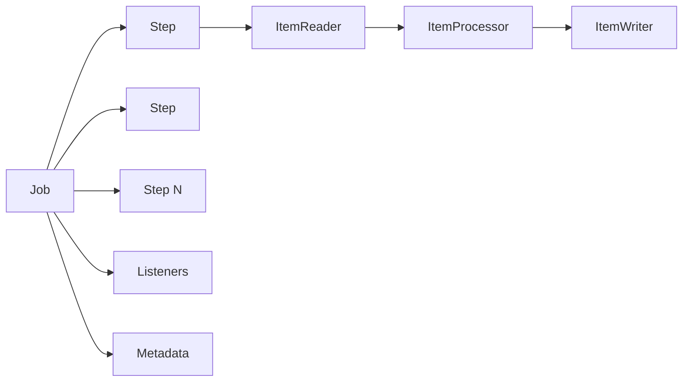
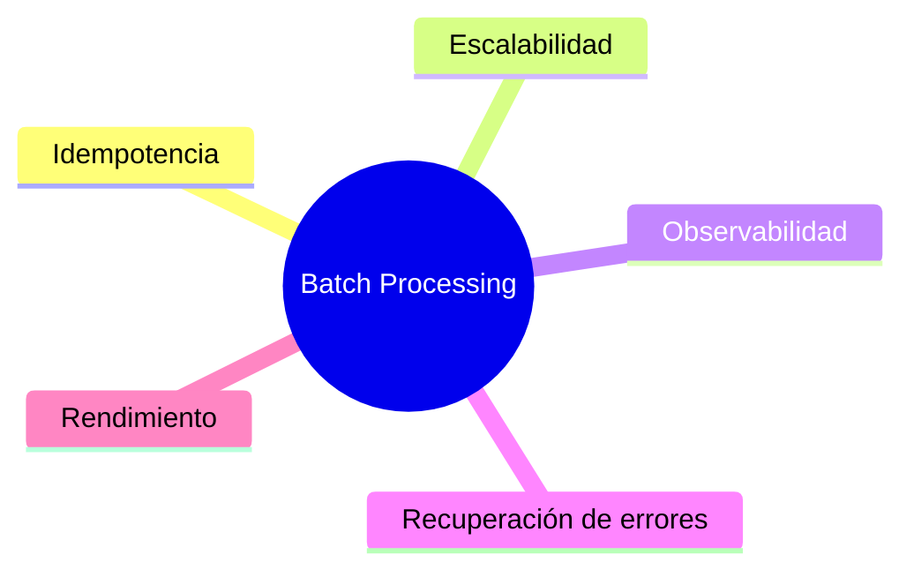

# 📘 Playbook Batch Processing v1.1.0 — Resumen Ejecutivo y Estándar de Desarrollo

> **Objetivo:** Definir el estándar para diseñar, desarrollar y operar procesos Batch en Spring Batch garantizando idempotencia, resiliencia, escalabilidad, observabilidad y recuperación ante fallas. [1](https://onuris-my.sharepoint.com/personal/1201791_onuriscp_com/Documents/Archivos%20de%20Microsoft%C2%A0Copilot%20Chat/Playbook_BatchProcessing_v1-1-0.md)

***

# 🎯 Resumen Ejecutivo

## Principios Fundamentales

Todo proceso Batch debe ser:

* ✅ Idempotente
* ✅ Transaccional
* ✅ Resiliente
* ✅ Autónomo
* ✅ Escalable
* ✅ Monitoreable
* ✅ Recuperable ante fallos
* ✅ Modular
* ✅ Eficiente en el uso de recursos

Estos principios constituyen la base de cualquier implementación Batch corporativa. [1](https://onuris-my.sharepoint.com/personal/1201791_onuriscp_com/Documents/Archivos%20de%20Microsoft%C2%A0Copilot%20Chat/Playbook_BatchProcessing_v1-1-0.md)

***

# 🏛 Arquitectura Conceptual



***

# 🔥 Reglas de Negocio

## 1\. Idempotencia Obligatoria

Un mismo Job ejecutado varias veces con los mismos parámetros debe producir exactamente el mismo resultado. [1](https://onuris-my.sharepoint.com/personal/1201791_onuriscp_com/Documents/Archivos%20de%20Microsoft%C2%A0Copilot%20Chat/Playbook_BatchProcessing_v1-1-0.md)

### Ejemplos Permitidos

* Generación de reportes
* Consultas
* Notificaciones
* Validaciones

### Ejemplos No Permitidos

* Duplicación de liquidaciones
* Duplicación de facturación
* Reprocesamiento financiero sin control

***

## 2\. Monitoreo Obligatorio

Todo Job debe registrar:

| Evento | Información requerida |
| ------ | --------------------- |
| Inicio | Nombre del proceso |
| Inicio | Parámetros recibidos |
| Fin | Tiempo total |
| Fin | Registros procesados |
| Fin | Archivos generados |
| Error | Excepción ocurrida |
| Error | Registro afectado |

[1](https://onuris-my.sharepoint.com/personal/1201791_onuriscp_com/Documents/Archivos%20de%20Microsoft%C2%A0Copilot%20Chat/Playbook_BatchProcessing_v1-1-0.md)

***

## 3\. Ejecución Fuera de Horario Operativo

Los Batch consumen:

* CPU
* RAM
* Red
* Base de datos

Por ello deben ejecutarse preferentemente fuera de horarios productivos. [1](https://onuris-my.sharepoint.com/personal/1201791_onuriscp_com/Documents/Archivos%20de%20Microsoft%C2%A0Copilot%20Chat/Playbook_BatchProcessing_v1-1-0.md)

***

## 4\. Extraer Solo Datos Necesarios

### Incorrecto

```sql
SELECT *
FROM CLIENTES;
```

### Correcto

```sql
SELECT ID_CLIENTE,NOMBRE
FROM CLIENTES;
```

Principio:

```text
Menos datos = menor consumo de recursos
```[1](https://onuris-my.sharepoint.com/personal/1201791_onuriscp_com/Documents/Archivos%20de%20Microsoft%C2%A0Copilot%20Chat/Playbook_BatchProcessing_v1-1-0.md)

---

## 5. Control de Integridad

Todo proceso debe responder:

```text
¿Cuántos registros entraron?
¿Cuántos se leyeron?
¿Cuántos se procesaron?
¿Cuántos se escribieron?
¿Cuántos fallaron?
```

[1](https://onuris-my.sharepoint.com/personal/1201791_onuriscp_com/Documents/Archivos%20de%20Microsoft%C2%A0Copilot%20Chat/Playbook_BatchProcessing_v1-1-0.md)

***

# 📋 Clasificación de Procesos Batch

| Tipo | Objetivo |
| ---- | -------- |
| Procesamiento de datos | Aplicar reglas de negocio |
| Procesamiento de archivos | CSV, TXT, Excel |
| Utilerías | Kafka, integraciones |
| Consultas BD | Reportes e informes |

***

# 🔄 Procesos Repetibles vs No Repetibles

## Procesos Repetibles

### Permitidos

* Lectura
* Reportes
* Notificaciones
* Utilerías
* Validaciones
* Procesamiento no crítico

### Estrategias

* Retry
* Reprocesamiento completo
* Reproceso parcial

```mermaid
flowchart LR
A[Error]
--> B[Retry]
--> C[Reintento]
```[1](https://onuris-my.sharepoint.com/personal/1201791_onuriscp_com/Documents/Archivos%20de%20Microsoft%C2%A0Copilot%20Chat/Playbook_BatchProcessing_v1-1-0.md)

---

## Procesos No Repetibles

### Incluyen

- Facturación
- Liquidaciones
- Cierres contables
- Sincronización crítica
- Actualizaciones sensibles

### Estrategias

- Rollback completo
- Rollback por Step
- Recuperación controlada

```mermaid
flowchart LR
A[Falla]
--> B[Rollback]
--> C[Recuperación]
```

[1](https://onuris-my.sharepoint.com/personal/1201791_onuriscp_com/Documents/Archivos%20de%20Microsoft%C2%A0Copilot%20Chat/Playbook_BatchProcessing_v1-1-0.md)

***

# 👨‍💼 Casos de Uso

## Caso 1 — Generación de Reportes

### Entrada

Datos desde BD

### Flujo

```text
Reader → Writer
```

### Salida

* CSV
* Excel
* PDF

### Tipo

Repetible

***

## Caso 2 — Cálculo Masivo

### Entrada

Millones de registros

### Flujo

```text
Reader → Processor → Writer
```

### Salida

Actualización masiva

### Tipo

Chunk Processing

***

## Caso 3 — Integración Kafka

### Entrada

Base de datos

### Flujo

```text
Reader → Processor → Kafka Writer
```

### Salida

Eventos

### Tipo

Utilería

***

## Caso 4 — Facturación

### Entrada

Movimientos financieros

### Flujo

```text
Reader → Reglas → Writer
```

### Salida

Facturas

### Tipo

No repetible

[1](https://onuris-my.sharepoint.com/personal/1201791_onuriscp_com/Documents/Archivos%20de%20Microsoft%C2%A0Copilot%20Chat/Playbook_BatchProcessing_v1-1-0.md)

***

# 🧩 Metodología de Desarrollo


## Prerrequisitos

* Entendimiento funcional
* Volumetría esperada
* Dependencias
* Secuencia de ejecución

Participantes mínimos:

* Backend Developer
* Technical Lead
* Responsable de Negocio[1](https://onuris-my.sharepoint.com/personal/1201791_onuriscp_com/Documents/Archivos%20de%20Microsoft%C2%A0Copilot%20Chat/Playbook_BatchProcessing_v1-1-0.md)

***

# 🚨 Estándares Obligatorios

## Tecnologías

| Tecnología | Versión |
| ---------- | ------- |
| Java | 21 |
| Maven | 3.2.3+ |
| Spring Batch | 5.1 |

***

## Estructura de Proyecto

```text
config/
config.repository/

constant/
dto/
exception/

listener/
listener.impl/

repository/
repository.impl/
repository.mapper/

step.reader/
step.processor/
step.writer/
step.tasklet/

util/
util.impl/
```[1](https://onuris-my.sharepoint.com/personal/1201791_onuriscp_com/Documents/Archivos%20de%20Microsoft%C2%A0Copilot%20Chat/Playbook_BatchProcessing_v1-1-0.md)

---

## Propiedades Obligatorias

```properties
batch.env
batch.grid.size
batch.block.size
batch.chunk.size
batch.skip.limit
```[1](https://onuris-my.sharepoint.com/personal/1201791_onuriscp_com/Documents/Archivos%20de%20Microsoft%C2%A0Copilot%20Chat/Playbook_BatchProcessing_v1-1-0.md)

---

# 🔧 Componentes Principales de Spring Batch

| Componente | Función |
|------------|----------|
| Job | Proceso completo |
| Step | Etapa del Job |
| ItemReader | Lectura |
| ItemProcessor | Transformación |
| ItemWriter | Escritura |
| Chunk | Bloque transaccional |
| Listener | Observación |
| JobRepository | Persistencia |
| ExecutionContext | Persistencia de contexto |[1](https://onuris-my.sharepoint.com/personal/1201791_onuriscp_com/Documents/Archivos%20de%20Microsoft%C2%A0Copilot%20Chat/Playbook_BatchProcessing_v1-1-0.md)

---

# 🏆 Patrón de Procesamiento Recomendado

## Chunk Processing (Estándar)


### Beneficios

* Menor uso de conexiones
* Mejor control transaccional
* Mayor rendimiento
* Mejor control de errores[1](https://onuris-my.sharepoint.com/personal/1201791_onuriscp_com/Documents/Archivos%20de%20Microsoft%C2%A0Copilot%20Chat/Playbook_BatchProcessing_v1-1-0.md)

***

# 🚀 Patrones de Diseño Obligatorios

## Pagination

### Problema

Alto consumo de memoria.

### Solución

Dividir la información en páginas.

```text
10,000 registros

Página 1 = 2,000
Página 2 = 2,000
Página 3 = 2,000
Página 4 = 2,000
Página 5 = 2,000
```[1](https://onuris-my.sharepoint.com/personal/1201791_onuriscp_com/Documents/Archivos%20de%20Microsoft%C2%A0Copilot%20Chat/Playbook_BatchProcessing_v1-1-0.md)

---

## Partitioning

### Problema

Procesamiento lento.

### Solución

Ejecutar particiones en paralelo.

```mermaid
flowchart TD

MASTER[Master Step]

MASTER --> P1[Partition 1]
MASTER --> P2[Partition 2]
MASTER --> P3[Partition 3]
MASTER --> P4[Partition 4]
```[1](https://onuris-my.sharepoint.com/personal/1201791_onuriscp_com/Documents/Archivos%20de%20Microsoft%C2%A0Copilot%20Chat/Playbook_BatchProcessing_v1-1-0.md)

---

## Skip & Retry

### Problema

Errores recuperables.

### Solución

Definir políticas de:

- Retry
- Skip
- Error Fatal

```mermaid
flowchart LR

A[Excepción]

A --> B{Recuperable?}

B -->|Si| C[Retry]

B -->|No| D[Skip]

D --> E[Continuar]
```

[1](https://onuris-my.sharepoint.com/personal/1201791_onuriscp_com/Documents/Archivos%20de%20Microsoft%C2%A0Copilot%20Chat/Playbook_BatchProcessing_v1-1-0.md)

***

# 📊 Configuración Recomendada de Recursos

## Chunk

| Parámetro | Valor |
| --------- | ----- |
| Chunk mínimo | 2500 |
| Chunk máximo | 5000 |

***

## Fetch Size

| Parámetro | Valor |
| --------- | ----- |
| Fetch Size | 1500 - 5000 |

***

## Pool de Conexiones

| Parámetro | Valor |
| --------- | ----- |
| Mínimo | 5 |
| Máximo | 50 |

***

## Hilos

```text
No exceder los núcleos disponibles del CPU.
```[1](https://onuris-my.sharepoint.com/personal/1201791_onuriscp_com/Documents/Archivos%20de%20Microsoft%C2%A0Copilot%20Chat/Playbook_BatchProcessing_v1-1-0.md)

---

# ⚠ Reglas para ItemProcessor

## NO HACER

- Consultas a Base de Datos
- Consumo de APIs
- Consumo de Kafka
- Consumo de Microservicios

### Motivo

El Processor se ejecuta por cada registro.

```text
1 millón de registros
=
1 millón de llamadas
```

El Processor únicamente debe transformar información. [1](https://onuris-my.sharepoint.com/personal/1201791_onuriscp_com/Documents/Archivos%20de%20Microsoft%C2%A0Copilot%20Chat/Playbook_BatchProcessing_v1-1-0.md)

***

# 👂 Listeners Obligatorios

## JobListener

Observa:

* Inicio
* Fin
* Métricas

***

## StepExecutionListener

Observa:

* Inicio de Step
* Fin de Step

***

## ItemReadListener

Observa:

* Lecturas
* Errores de lectura

***

## ItemProcessListener

Observa:

* Transformaciones
* Errores de proceso

***

## ItemWriteListener

Observa:

* Escritura
* Errores de persistencia

***

## ChunkListener

Observa:

* Commit
* Rollback

***

## SkipListener

Observa:

* Registros descartados[1](https://onuris-my.sharepoint.com/personal/1201791_onuriscp_com/Documents/Archivos%20de%20Microsoft%C2%A0Copilot%20Chat/Playbook_BatchProcessing_v1-1-0.md)

***

# 🔐 Buenas Prácticas No Negociables

## Uso de Transacciones

### Procesos Repetibles

```java
@Transactional
```

### Procesos Críticos

```java
@Transactional(
    propagation = Propagation.REQUIRES_NEW
)
```

[1](https://onuris-my.sharepoint.com/personal/1201791_onuriscp_com/Documents/Archivos%20de%20Microsoft%C2%A0Copilot%20Chat/Playbook_BatchProcessing_v1-1-0.md)

***

## Recuperación de Errores

Todo proceso debe definir:

```text
Retry
Skip
Rollback
Restart
```[1](https://onuris-my.sharepoint.com/personal/1201791_onuriscp_com/Documents/Archivos%20de%20Microsoft%C2%A0Copilot%20Chat/Playbook_BatchProcessing_v1-1-0.md)

---

## Metadata Obligatoria

Spring Batch debe persistir:

```text
BATCH_JOB_INSTANCE
BATCH_JOB_EXECUTION
BATCH_STEP_EXECUTION
BATCH_JOB_EXECUTION_CONTEXT
BATCH_STEP_EXECUTION_CONTEXT
```

Esto permite:

* Reinicios
* Auditoría
* Recuperación
* Monitoreo[1](https://onuris-my.sharepoint.com/personal/1201791_onuriscp_com/Documents/Archivos%20de%20Microsoft%C2%A0Copilot%20Chat/Playbook_BatchProcessing_v1-1-0.md)

***

## Procesamiento Paralelo

Utilizar:

```java
ThreadPoolTaskExecutor
```

y

```java
Partitioning
```

cuando el proceso lo permita.[1](https://onuris-my.sharepoint.com/personal/1201791_onuriscp_com/Documents/Archivos%20de%20Microsoft%C2%A0Copilot%20Chat/Playbook_BatchProcessing_v1-1-0.md)

***

# ❌ Anti-Patrones

| Anti-Patrón | Consecuencia |
| ----------- | ------------ |
| SELECT \* | Sobreconsumo |
| Chunk enorme | OutOfMemory |
| Processor consumiendo servicios | Bajo rendimiento |
| Sin Metadata | No recuperable |
| Sin Listeners | Sin trazabilidad |
| Jobs no idempotentes | Duplicidad |
| Reintentos infinitos | Saturación |
| Sin Partitioning | Bajo desempeño |

***

# ✅ Checklist de Cumplimiento

| Validación | Obligatorio |
| ---------- | ----------- |
| Idempotencia | ✅ |
| Metadata Spring Batch | ✅ |
| Reader Processor Writer | ✅ |
| Chunk Processing | ✅ |
| Retry y Skip | ✅ |
| Manejo de excepciones | ✅ |
| Monitoreo | ✅ |
| Listener | ✅ |
| Control transaccional | ✅ |
| Pruebas de estrés | ✅ |
| Pruebas de volumetría | ✅ |
| Modularización | ✅ |
| Uso eficiente de BD | ✅ |
| Paralelización cuando aplique | ✅ |

***

# 🎯 Los 5 Pilares del Estándar Batch



## Regla Final

Si un Batch cumple:

* Idempotencia
* Monitoreo
* Metadata
* Retry & Skip
* Chunk Processing
* Separación Reader / Processor / Writer
* Control Transaccional
* Recuperación ante Fallos

entonces está alineado con el estándar definido en el Playbook corporativo. [1](https://onuris-my.sharepoint.com/personal/1201791_onuriscp_com/Documents/Archivos%20de%20Microsoft%C2%A0Copilot%20Chat/Playbook_BatchProcessing_v1-1-0.md)